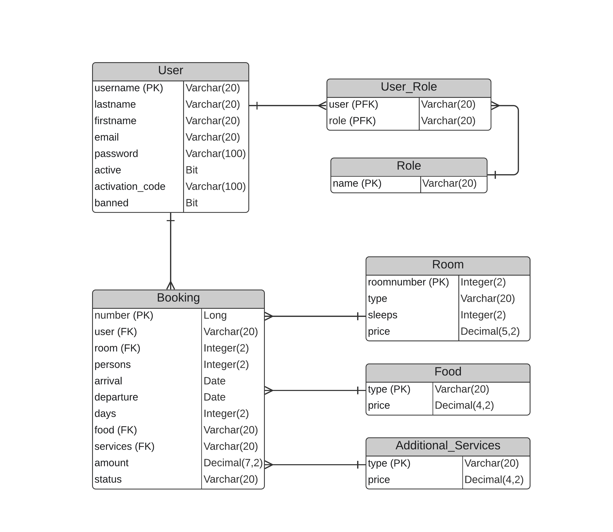

#Web-Project. Hotel Booking system
___
#Project Overview
___
##The client fills out an Application specifying the number of beds in the room, the class of apartments and the time of stay. The administrator reviews the received Application, selects the most suitable of the available Rooms, after which the system issues an Invoice to the Client.
___
##Roles in project
___
###Unauthorised user (anonymous)
- View prices
- View the photo gallery
- View general information about the hotel
- Sign Up
- Log In

###User
- View prices
- View the photo gallery
- View general information about the hotel
- Book a room
- View information about your bookings
- Delete booking

###Admin
- View user information
- Block a user
- Unblock a user
- Delete a user
- Add the admin role to the user
- Remove the admin role from the user
- Book a room
- View information about all bookings
- Change a room in a user's booking
- Change booking status
- Send an invoice to the user
- Delete booking
- View information about all rooms
- Change the price of a room
- Delete room
- View information about available rooms in a certain period of time
- Change the parameters of existing rooms
- Change the price of meals and additional services
- Add a new room
___
###Database visualization
___
